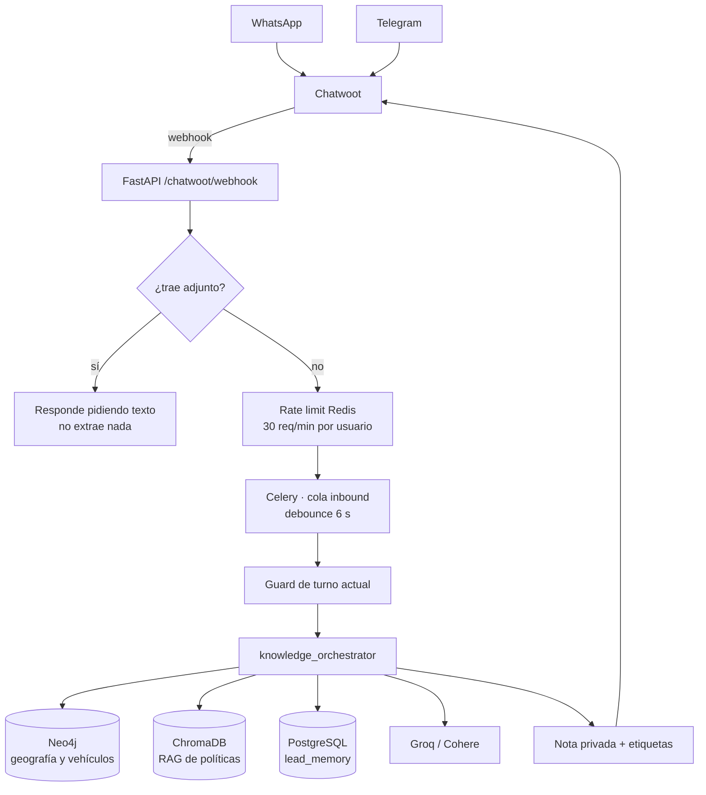

# driver-recruiting-agent

**Agente conversacional que perfila candidatos a operador de tráiler durante la conversación, y le entrega al reclutador un expediente accionable sin que tenga que leer el chat.**

El bot se llama **Mundo**.

---

## El problema

Reclutar operadores de quinta rueda es alto volumen y baja calidad de datos. Los candidatos llegan por WhatsApp y Telegram, contestan a medias, mandan fotos en vez de texto, escriben "torreon" o "TORREÓN, COAH" indistintamente, y dicen "sí tengo licencia" sin decir de qué tipo.

El reclutador terminaba leyendo conversaciones completas para responder tres preguntas: **¿este candidato sirve, qué le falta, y qué sigue?** Con decenas de conversaciones abiertas al mismo tiempo, eso no escala — y los candidatos buenos se enfrían mientras tanto.

## Qué hace

Mundo conversa, extrae los datos del perfil conforme aparecen y deja en Chatwoot una **nota privada estructurada** más etiquetas, de modo que el reclutador abre la conversación y ve de inmediato:

| | |
|---|---|
| Identidad | nombre, teléfono, ciudad, estado, edad |
| Habilitación | tipo de licencia, apto médico, experiencia, tipo de unidad |
| Documentos | cuáles entregó y cuáles faltan |
| Logística | si es foráneo, si requiere apoyo de traslado |
| Decisión | campos faltantes, siguiente acción, temperatura del candidato |

El reclutador no lee el chat: lee la nota.

## Arquitectura



### Las dos decisiones que sostienen el sistema

**1. Jerarquía de prioridad estricta.** Cuando varias fuentes contradicen, gana la más cercana al candidato:

```
turno actual  >  lead_memory  >  grafo Neo4j  >  RAG  >  generación del LLM
```

Si el candidato acaba de decir "soy de Gómez Palacio", eso pesa más que lo que el sistema creía saber, y muchísimo más que lo que el modelo quiera improvisar. El LLM es el último recurso, no el primero.

**2. Los adjuntos se bloquean antes de tocar nada.** Imágenes, stickers, audios y documentos se interceptan en el webhook, **antes** de la extracción y de la cola: el bot pide una respuesta en texto y no altera el perfil. Sin OCR, una foto no puede confirmar una licencia — y un dato inventado a partir de una imagen contamina el expediente de forma silenciosa. Incluso las imágenes con pie de foto se bloquean: el texto del caption no se parsea como hecho.

### Normalización antes que modelo

La geografía y los tipos de unidad se resuelven contra un **grafo de Neo4j** con alias, no con prompts. "Torreón", "torreon" y "TRC" caen en el mismo nodo. Un LLM también podría resolverlo, pero no de forma reproducible ni auditable — y aquí un error de ciudad cambia si el candidato es foráneo, que a su vez cambia si aplica apoyo de traslado.

## Stack

| Componente | Rol |
|---|---|
| FastAPI | Webhook y API |
| LangGraph | Orquestación del flujo conversacional |
| Celery + Redis | Cola de entrantes, debounce y rate limiting |
| PostgreSQL | Memoria del lead: identidad, hechos, eventos, resumen |
| Neo4j | Grafo de geografía y tipos de vehículo con alias |
| ChromaDB | RAG sobre políticas y documentos internos |
| Groq / Cohere | Generación (timeout de 8 s) |
| Chatwoot | Bandeja del reclutador: conversación, notas y etiquetas |
| Docker Compose | Despliegue completo |

## Cómo ejecutarlo

Requisitos: Docker y Docker Compose.

```bash
cp .env.example .env          # credenciales de Chatwoot, LLM y base de datos

docker compose up -d --build  # FastAPI, Postgres, Chatwoot, Redis, Nginx, ngrok

# Neo4j vive en su propio compose
docker compose -f docker-compose.neo4j.yml up -d neo4j

# Semilla del grafo (idempotente)
docker cp db/neo4j_seed_geo_vehicle.cypher hr_neo4j:/tmp/seed.cypher
docker exec hr_neo4j cypher-shell -u neo4j -p "$NEO4J_PASSWORD" --file /tmp/seed.cypher

curl http://localhost:8000/health
```

Migraciones SQL en `db/`, en orden numérico:

```bash
psql "$DATABASE_URL" -f db/init_hr_memory.sql
```

Logs de lo que importa:

```bash
docker logs --tail=200 hr_worker 2>&1 | \
  grep -Ei "CURRENT_TURN_GUARD|CHATWOOT_NOTE_SYNC|RATE_LIMITED|SCHEDULER|ERROR"
```

> El servicio `api` corre código *horneado* en la imagen (sin volumen ni `--reload`): un cambio en el webhook exige `docker compose up -d --build api`, no un simple restart.

## Estado y alcance

| | |
|---|---|
| Código de aplicación | 57 módulos Python, ~16 600 líneas |
| Pruebas | 63 archivos de test (unitarias, integración y *evals* de conversación) |
| Método | **OpenSpec Driven Development**: ningún cambio sin especificación aprobada en `openspec/changes/` |
| Documentación | Especificaciones vivas en `openspec/specs/`, auditorías y deuda técnica en `docs/` |

<!-- CAPTURA: nota privada generada por Mundo en Chatwoot, con el perfil del candidato y las etiquetas. -->
<!-- CAPTURA: conversación de WhatsApp mostrando el media guard (el bot pide respuesta en texto). -->

## Qué construí

El sistema completo: el flujo conversacional en LangGraph, la orquestación de conocimiento con su jerarquía de prioridad, el extractor de perfil, el grafo de normalización en Neo4j, la capa de memoria en PostgreSQL, la integración con Chatwoot (notas y etiquetas), el media guard, la infraestructura en Docker y la suite de pruebas.

También la disciplina de especificación: cada capacidad del sistema está descrita en `openspec/` antes de existir en código.

## Autor

**David Ramos** — Data / AI Engineer

[LinkedIn](https://www.linkedin.com/in/david-ramos-anguiano-3a647827a/) · david.24000@hotmail.com
